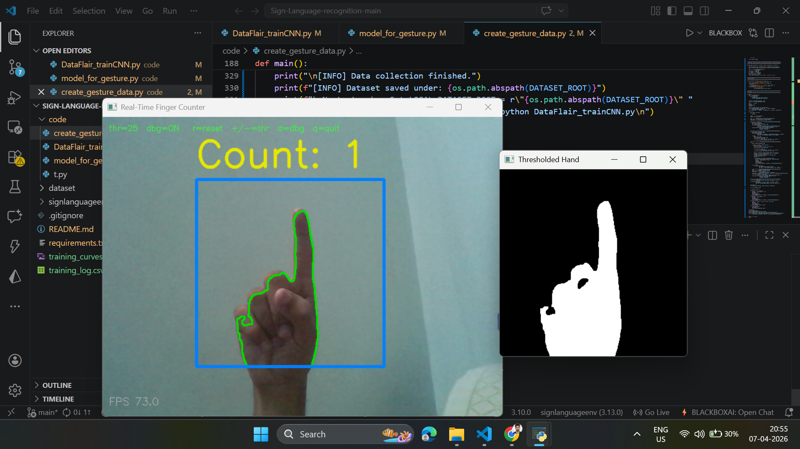
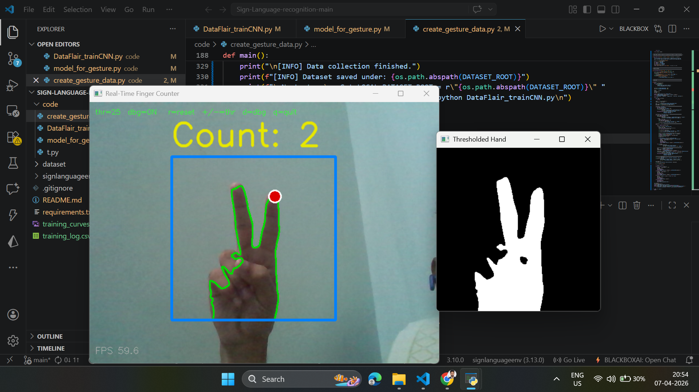
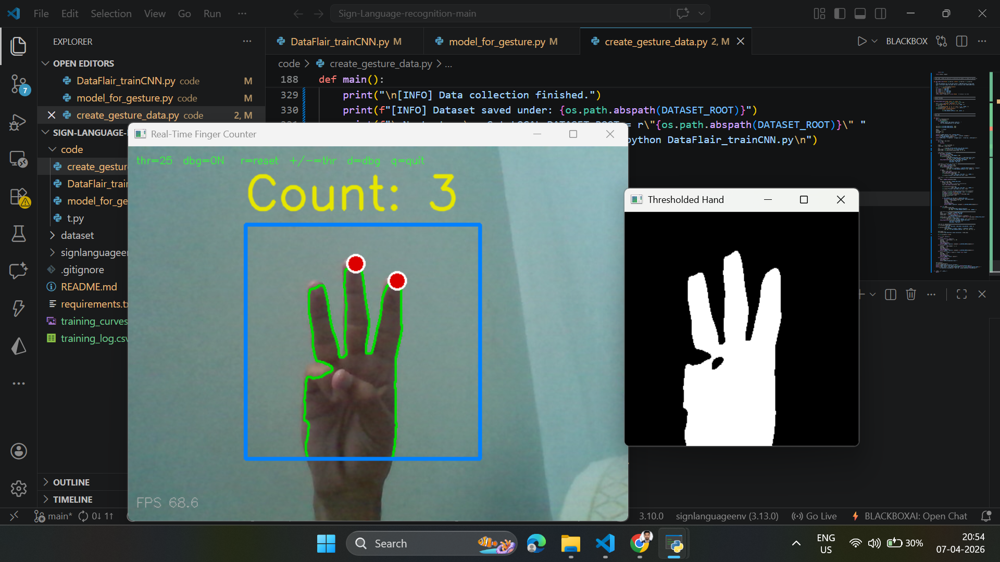
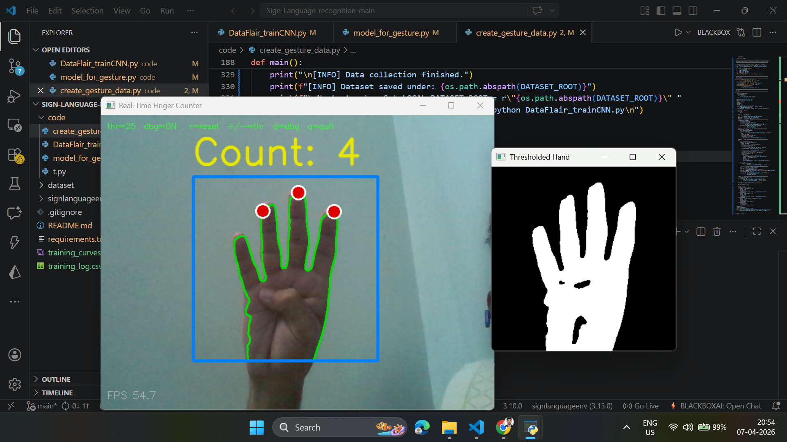
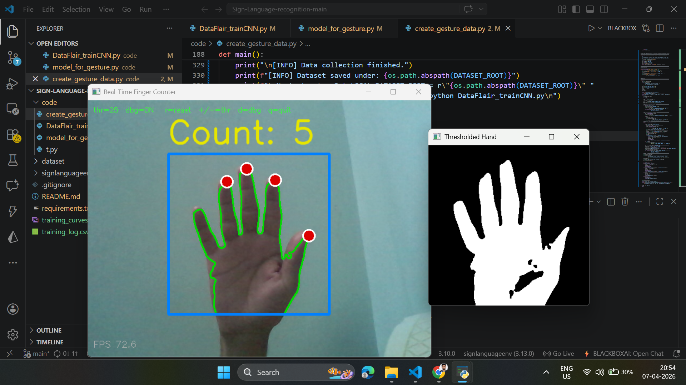

# ✋ Real-Time Finger Counting using OpenCV (1–5)
### Natural hand gesture number recognition using contour defects

---

## 📌 Project Overview
This project detects and counts **natural finger gestures from 1 to 5 in real time** using your webcam.

Instead of using a CNN model or Kaggle dataset, this project uses:

- OpenCV
- Background subtraction
- Contour extraction
- Convex Hull
- Convexity Defects
- Fingertip counting

This makes it **faster, lightweight, and more accurate for natural finger counting gestures**.

---

## 🚀 Features
- ✅ Real-time webcam finger counting
- ✅ Detects **1 to 5 fingers**
- ✅ No TensorFlow / no `.h5` model needed
- ✅ No Kaggle dataset required
- ✅ Fast OpenCV contour processing
- ✅ Adjustable threshold controls
- ✅ Background recalibration
- ✅ Debug threshold window
- ✅ Stable output for natural gestures

---

 ## 📁 Project Structure## 📸 Finger Counting Demo

### ☝️ One Finger

### ✌️ Two Fingers

### 🤟 Three Fingers

### 🖖 Four Fingers

### 🖐️ Five Fingers
